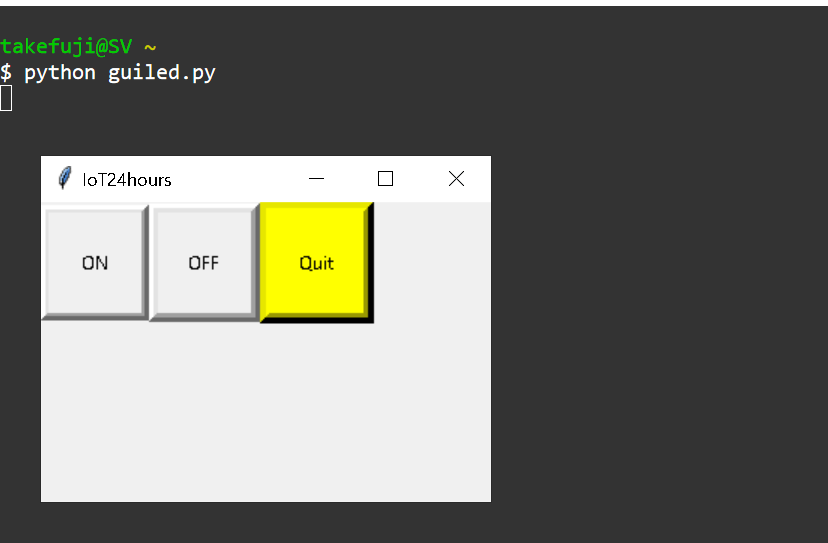
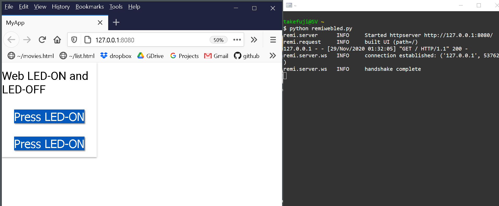

# IoT

All python codes were tested on Windows 10 using Arduino Nano.
Arduino Nano (ATMEGA328P) is composed of 30 pins DIP with 32 KB ISP flash memory with read-while-write capabilities, 1 KB EEPROM, 2 KB SRAM, 23 general purpose I/O lines, 32 general purpose working registers, three flexible timer/counters with compare modes, internal and external interrupts, serial programmable USART, a byte-oriented 2-wire serial interface (I2C), SPI serial port, 6-channel 10-bit A/D converter.

You should download and install open-source Arduino Software (IDE):
<a href="https://www.arduino.cc/en/main/software"> Arduino Software(IDE)</a>

# Library version is very important since different version can cause many problems.
The following real-time spectrum analyzer is a good example for educators to know 
local libraries and default libraries:
arduinoNANO-I2C(OLED128x32)-microphone-USB-PC
<pre>
Use fftOLED.ino, fix_fft.h, and fix_fft.cpp.
OLED128x32 has I2C interface where there are two libraries: 
Adafruit_GFX.h and Adafruit_SSD1306.h.
Adafruit_GFX.h is OLED graphic library while Adafruit_SSD1306.h is a driver software.
A set of fix_fft.h and fix_fft.cpp is a FFT library.
You must use Adafruit_SSD1306.h (driver) with verson 1.1.0 or 1.1.2.
If you use the different version driver, you can feel the OLED display is so slow.

&#60fix_fft.h&#62 means installed default library while "fix_fft.h" means local library 
in the same folder of fftOLED.ino file.
</pre>
<a href='https://www.youtube.com/watch?v=NABdw3JH1IE'> VIDEO</a>

<a href='https://www.youtube.com/watch?v=wWtuWTPgbos'> slow response VIDEO</a>

# PC to arduino communication
<pre>
Use onoff.ino for led-on or led-off.

Use on.py and off.py for led-on or led-off.
$ python on.py
$ python off.py
</pre>

# arduinoNANO-USB-PC
<pre>
blinkN.py receives the typed number from terminal and sends it to arduino Nano through USB. 
A single LED with blinkN.ino blinks by the given number of times. 
typed "q" terminates the program.
HINT: use serial library by "import serial". 
HINT: s=serial.Serial('com3',9600) indicates the port (com3) and baudrate (9600) respectively.

$ python blinkN.py
ready
enter: 1
enter: 3
enter: 4
enter: q
</pre>
<a href='https://youtu.be/pyEo5iOtCAY'> VIDEO</a>
# exercises for students
Make blinkN2.ino for accommodating two digits or more. blinkN.ino can accept a single digit.

Make blinkN2.py for sending two digits or more. 

<pre>
Hint: arduino
Use Serial.readString()
Use str.toInt() for converting string to integer where str is the received string.
Hint: Python
Use str.encode('utf8') when serial str.write().
</pre>

microphone--arduinoNANO--USB-PC
<pre>
oscillo.py and mic.ino using MAX4466 (High Precision Preamplifier Electret Microphone Amplifier)
with 3 pins.

### WARNING ####
In order to use pyrealtime on bash on ubuntu on windows (WSL),
you must modify the layer.py as follows using ttyS3 port example:
layer.py is at miniconda3/lib/python3.7/site-packages/pyrealtime/layer.py

Add two lines in layer.py before line 235 and modify line 237:
235:            import serial
236:            self.ser=serial.Serial('/dev/ttyS3')
Disable 237 line by #
    def run_thread(self):
        try:
            import serial
            self.ser=serial.Serial('/dev/ttyS3')
            #self.initialize()
### WARNING ####

# captured analog data (10-bit) using microphone will be transmitted from Arduino Nano to PC
through USB. oscillo.py is more stable than mic.py.
$ python oscillo.py 
or
$ python mic.py

# ASSIGNMENT: use a single LED instead of microphone.
# An LED is a device to generate electric power using light.
# Contrarily, an LED is also a light-emitting diode using electric power.
modify mic.py or oscillo.py using a single LED for sensing the intensity of light.
</pre>
<a href='https://www.youtube.com/watch?v=yCwpIfL0nUM'>VIDEO_mic</a>
<a href='https://youtu.be/Lj34cn2UcCo'> VIDEO_led</a>
--------------------------
adxl345--arduino-USB-PC
<pre>
ADXL345 (I2C) is a 3-axis accelerometer with high resolution (13-bit) measurement 
at up to ±16 g. 
pitch_roll.ino using I2C generates pitch and role respectively.

pitch_roll.ino
|__ADXL345.cpp
|__ADXL345.h
$ python pitch_roll.py
</pre>
<a href='https://youtu.be/7ekkDMEk4o0'> VIDEO</a>

--------------------------
BME280--arduino-USB-PC
<pre>
BME280 (I2C) is a weather sensor (air pressure, temperature, humidity). 
bme280.ino using I2C generates air pressure, temperature, humidity, and HI(heat index) respectively.
# On PC, use miniterm to display weather information of 4 parameters.
# This example shows com3 as Arduino port on PC.
$ miniterm com3
101108 23  60  70
101105 23  60  70
101107 23  60  70
...
</pre>
--------------------------
light sensor 
<pre>
tcs34725--arduino-PC
tcs34725.ino
</pre>
--------------------------
co2 sensor: MH-Z16 co2 sensor based on NDIR
<pre>
Measured data is displayed on OLED128x64.  
U8glib manages displaying data on OLED.

MH-Z16 is a very accurate 
OLED128x64_mhz16.ino
|__NDIR_SoftwareSerial.h
|__NDIR_SoftwareSerial.cpp
|__U8glib.h
</pre>
--------------------------
earthquake(adxl345)+weather(bme280:air,temp,humid)
<pre>
ADXL345 (3D-shaking) and BME280 (aid pressure, temperature, humidity) data are displayed
on OLED128x64 using U8glib.

OLED_adxl345_bme280.ino
|__ADXL345.cpp
|__ADXL345.h
|__BME280I2C.cpp
|__BME280I2C.h
</pre>
<a href='https://youtu.be/0GyXGndFAKk'> VIDEO</a>
--------------------------
PONG game
<pre>
PONG.ino is a game of ping pong where ADXL345 gives input of pitch and role 
for controlling a ball.

PONG.ino
|__Adafruit_GFX.h
|__Adafruit_SSD1306.h
|__ADXL345.h
|__ADXL345.cpp
</pre>
---------------------------
servo+adxl345
<pre>
servo_adxl345.ino manipulates a servo based on pitch and role by ADXL345.

servo_adxl345.ino
|__ADXL345.h
|__ADXL345.cpp
|__Servo.h
</pre>
---------------------------
<a href='https://youtu.be/BsDuZaXPQck'> VIDEO</a>

---------------------------
Assignment: gmail unread messages; LED blinks the number of unread messages
<pre>
gmailcheck.py on PC is to indicate the number of unread messages in gmail.
Create gcheck.py by modifing gmailcheck.py to blink LEDs depending on given number.
Create blink.ino on Arduino where LED blinks the number of unread messages.
HINT: use "serial" for communications between PC and Arduino.
HINT: /dev/ttyS3 in Bash ubuntu on Windows, COM3 in Windows
HINT: the number of blinks can be built by using "for loop" in Arduino.
HINT: use cron for regularily executing command
# run crontab:
$ sudo service cron start
# depict cron content by crontab -e (edit)
$ crontab -e
# set SHELL, PATH, commands(minute, hour, day, month, day of the week, command)
SHELL=/bin/bash
PATH=/home/takefuji/miniconda3/bin:/home/takefuji/miniconda3/condabin:/usr/local/sbin:/usr/local/bin:/usr/sbin:/usr/bin:/sbin:/bin
# every minute gcheck.py will be executed.
* * * * * python gcheck.py >/dev/null
# ┌───────────── minute (0 - 59)
# │ ┌───────────── hour (0 - 23)
# │ │ ┌───────────── day of the month (1 - 31)
# │ │ │ ┌───────────── month (1 - 12)
# │ │ │ │ ┌───────────── day of the week (0 - 6) (Sunday to Saturday;
# │ │ │ │ │                                   7 is also Sunday on some systems)
# │ │ │ │ │
# │ │ │ │ │
# * * * * * command to execute
</pre>
---------------------------
<a href='https://youtu.be/ExHR-klQG3w'> VIDEO</a>

# firmata: you can control arduino from Python.

<pre>
How to install firmata on PC and Arduino
On PC using pip command in Python
$ pip install pyfirmata
On Arduino IDE menu for firmata installation on your arduino
File -> Examples -> StandardFirmata

On terminal of PC
$ cat ledonoff.py
'''this is an example of led-on and led-off of digital port #2'''
import pyfirmata
from time import sleep
b=pyfirmata.Arduino('COM3')
i=pyfirmata.util.Iterator(b)
b.digital[2].write(1)
sleep(1)
b.digital[2].write(0)

To read analog port[0]
b.analog[0].read()

</pre>

# web server+ captured data + browser
<pre>
Expand web_flask.tar.
In order to use this program, modify server.py for serial port and baud rate in capturing a single sensor.
The important files are server.py (plaing as server and capturing data from an IoT device), templates/index.html, 
static/js/script.js and static/css/style.css.
The current settings of an IoT device are as follows: com3 port and 115200 baud rate in server.py.
The captured data is displayed on the browser by accessing to http://127.0.0.1:5000/
To run:
$ python server.py
Then, access to server using any browser: http://127.0.0.1:5000/
</pre>

# GUI controls LED-ON and LED-OFF using tkinter
<pre>
tkinter is installed with your Python.
To see the version of tkinter:
$ python -m tkinter
A new window will be opened which shows the version.

guiled.py is an example for controlling led-on and led-off from GUI using tkinter.
$ python guiled.py
Three buttons are used for turning led-on, led-off, and quit respectively.
ledonoff.ino is used in this demo.
</pre>

# Web browser controls LED-ON and LED-OFF using remi
<pre>
remiwebled.py is an example for controlling led-on and led-off from web browser.
To install remi:
$ pip install remi
remi can create a web server without html file, can display captured data from IoT devices on web browser,
and can send data or commands to IoT devices.
To run:
$ python remiwebled.py
The current settings in remiwebled.py are as follows: 'COM3',9600, address='127.0.0.1', port=8080 respectively.
Two buttons are for led-on and led-off respectively.
ledonoff.ino is used in this demo.
</pre>

